# Deploying Dynamic Webserver using LAMP in Amazon-Linux 
## Introduction:  
This project display how to set up and deploy a dynamic web server using the 
LAMP (Linux, Apache, MySQL, PHP) in Amazon Linux. The LAMP stack is one of the 
most widely used open-source solutions for hosting dynamic websites and web 
application. 
 Linux – Operating system (Ubuntu / Amazon- linux)  
 Apache – Web server to serve Http request 
 MySQL / Mariadb – Database server to store application data  
 PHP – Server-side scripting language for dynamic content 
# Step of deployment 
## Step1: Linux ec2 instance 

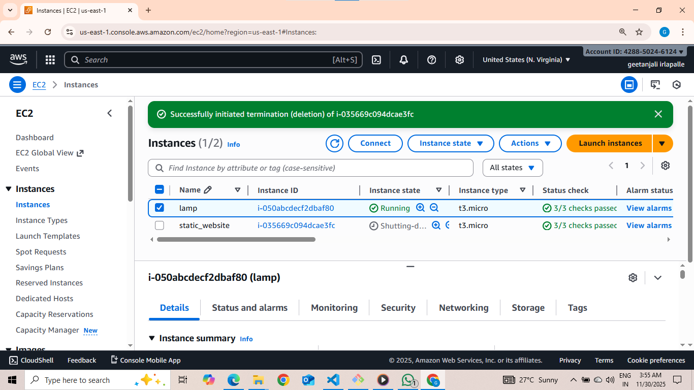

## Step2 : Connect the ec2 instances and updates the packages 
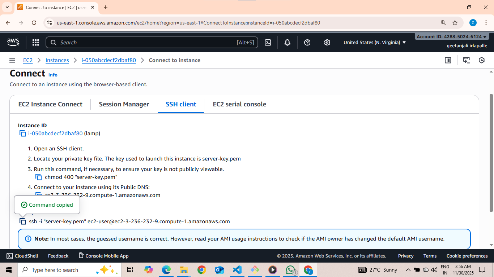

## Step3: Install package manager httpd- 
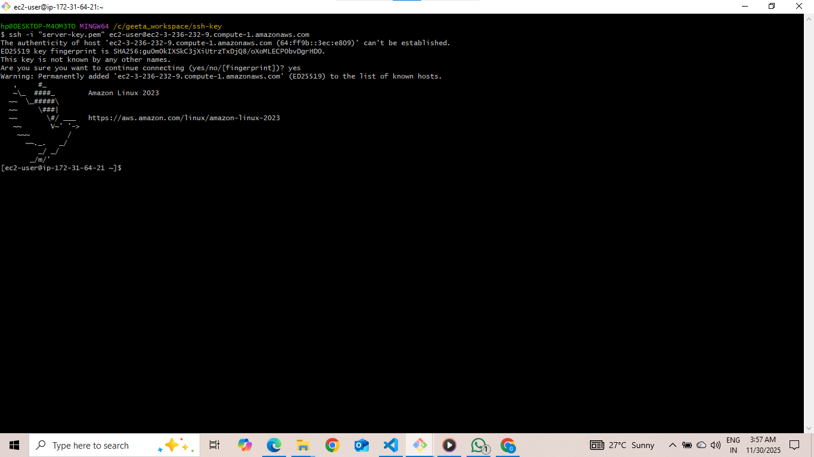

## Step4: Check the instances Start ,enable, status httpd instances 

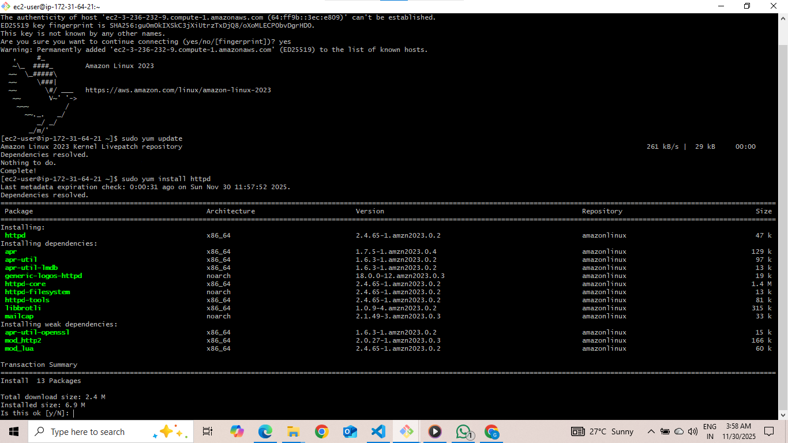

 
 
## Step5: Install the  mariadb105-server database

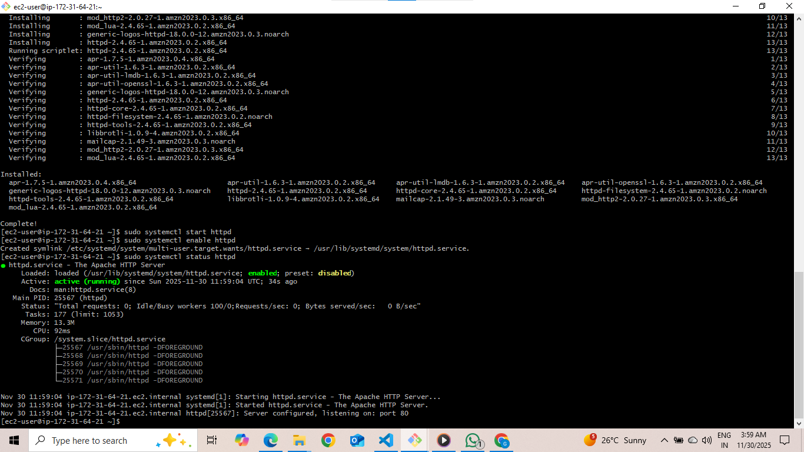

 
 
 
## Step6: Check the mariadb 105-server start ,enable ,status. 

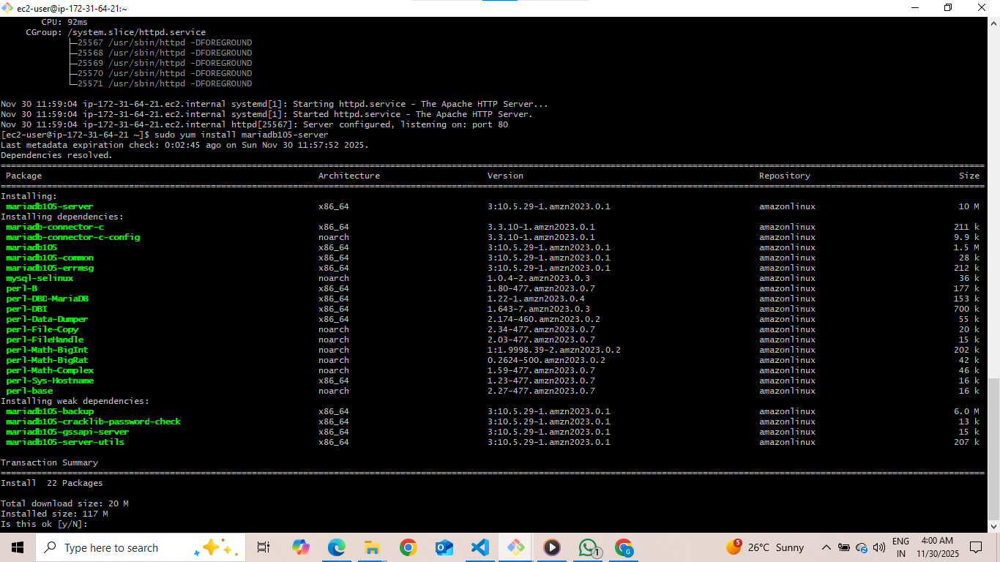

## Step7: Install php and extension  
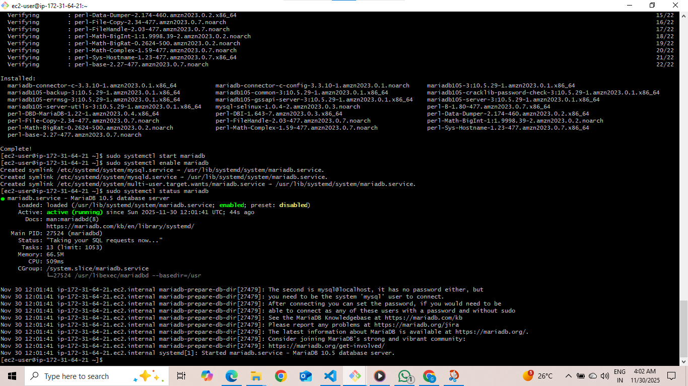

## Step8 Start and enable ,status of the php –fpm  
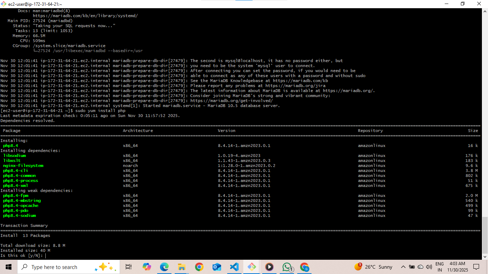

## Step 9: Go to html folder and edit the files using vim editor- 
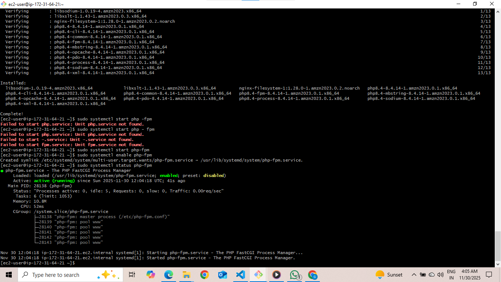

## Step10: Write a simple html file. 
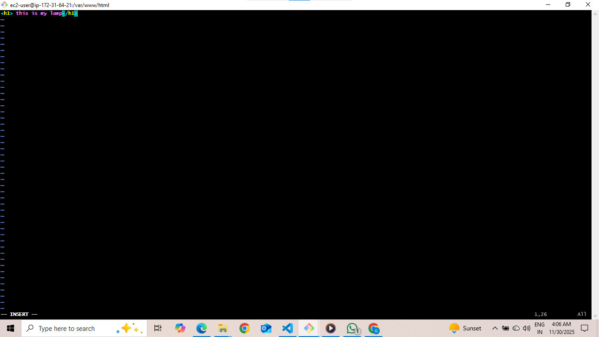

## Step11:  Create a index.php file 

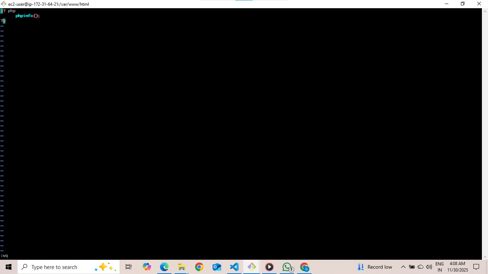

## Step12: Write a simple php file 

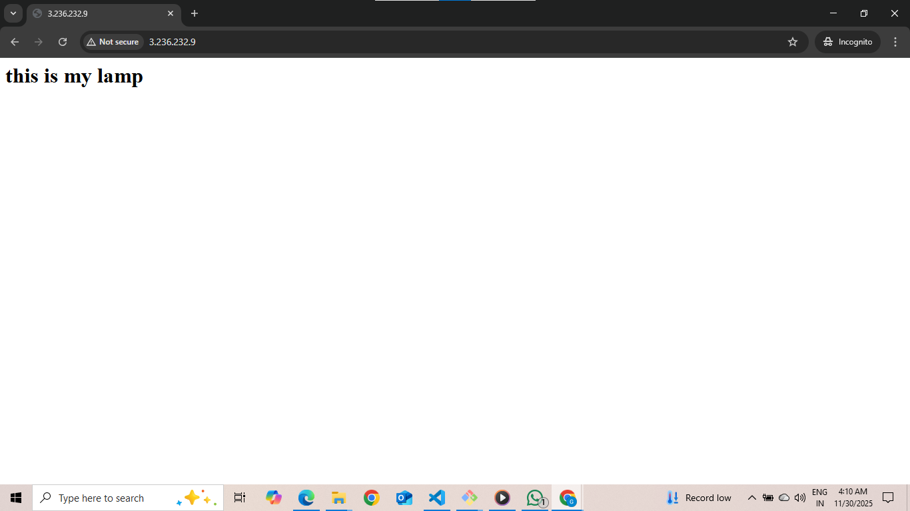

 
 
## Step13:  Test Website copy the public IP address and past. 

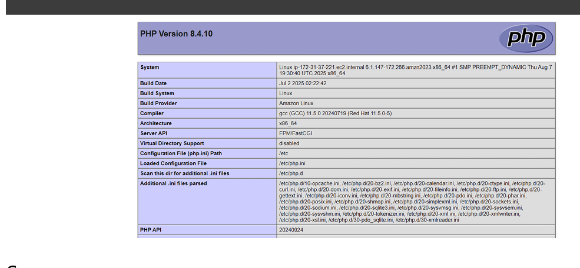

 
 
 
 
 
 
 
 
 
 